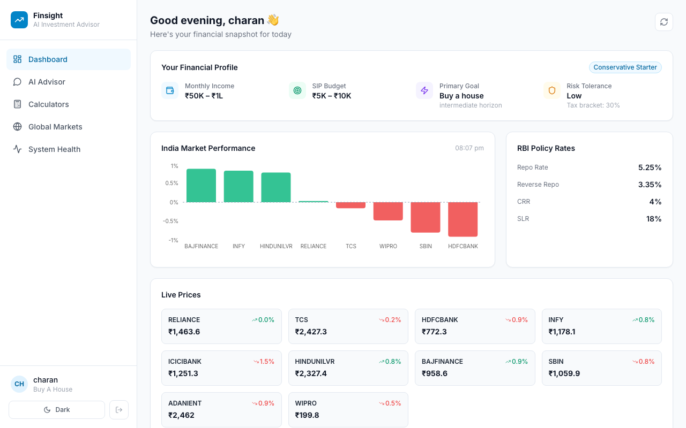
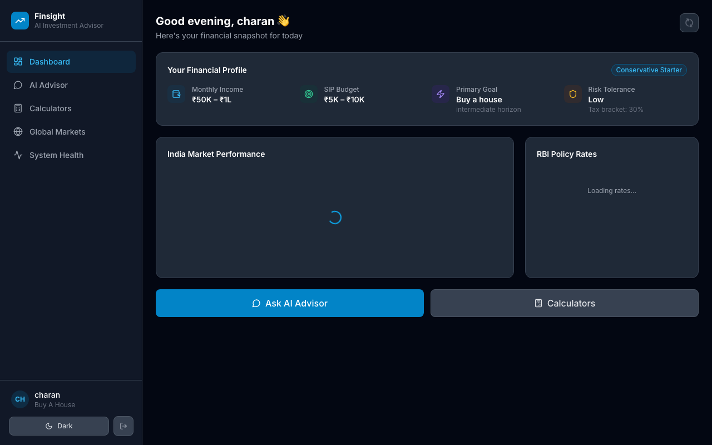
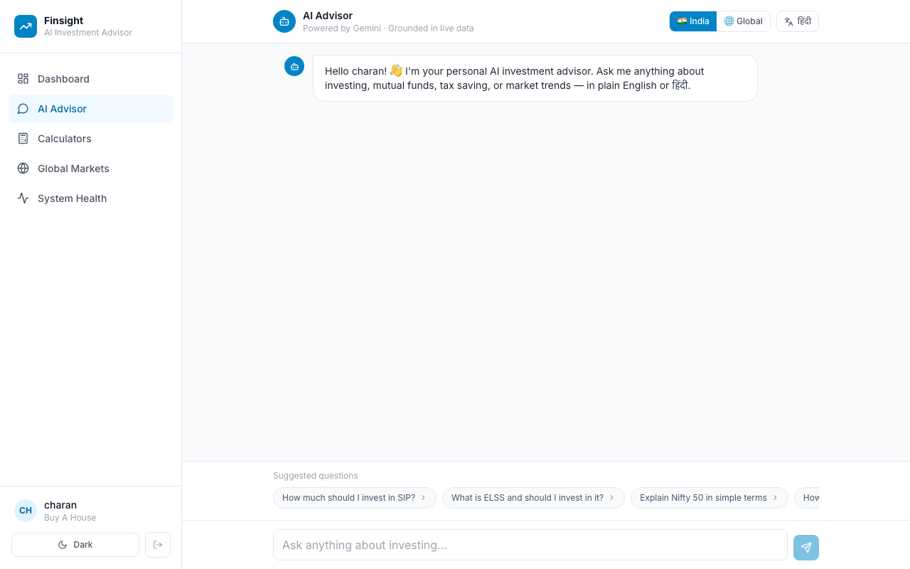
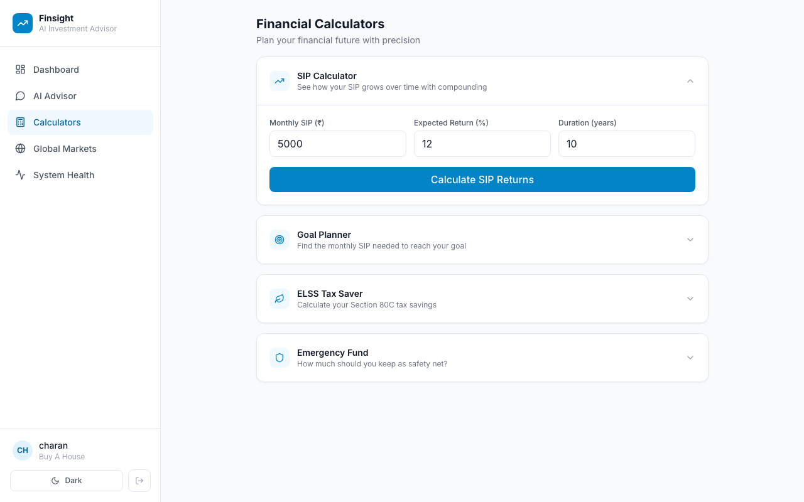
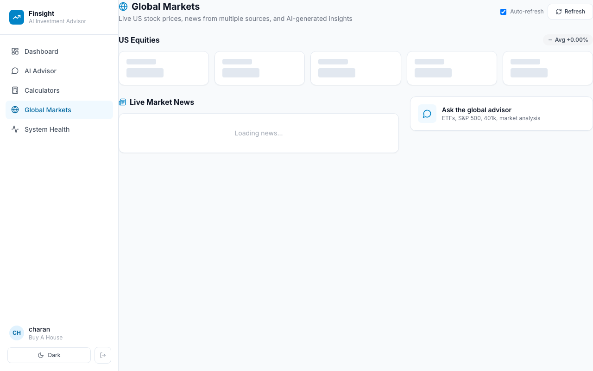
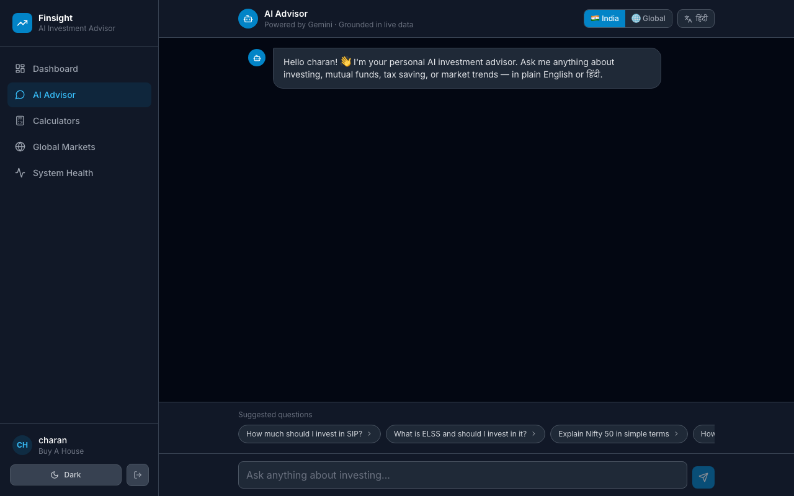
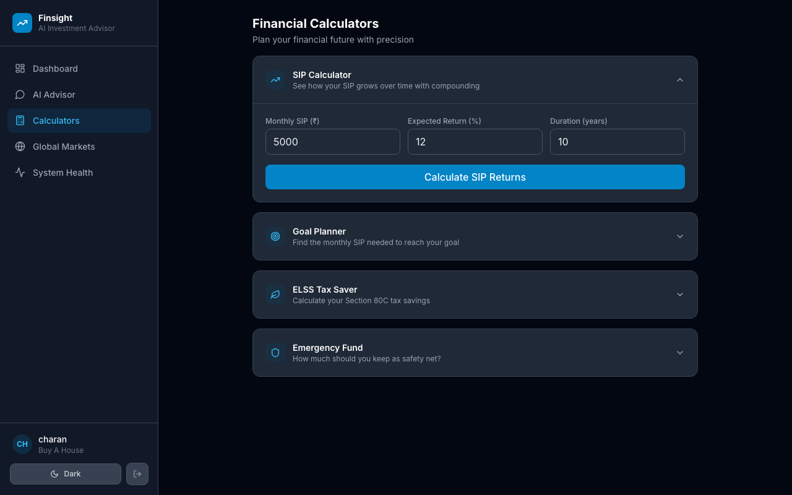

# FinSight AI

**An agentic investment advisor that grounds every answer in live market data, explains
the reasoning behind each recommendation, and tells you exactly how much to trust it.**

No black boxes. No generic advice. No hallucinations dressed up as insight.

---

## Two Products, One Platform

| | FinSight India | FinSight Global |
|---|---|---|
| **Coverage** | NSE equities, mutual funds, RBI macro, India news | US equities, SEC filings, FRED macro, global news |
| **Language** | English + Hindi (one toggle) | English |
| **Advisor** | India-tuned (SIP, ELSS, PPF, NPS, LTCG) | Global macro and US equity focus |
| **Mobile** | Android APK via Capacitor | Web only |

---

## Screenshots

### Dashboard — Light Mode


### Dashboard — Dark Mode


### AI Advisor Chat


### Financial Calculators


### Global Markets


### Dark Mode — Chat & Calculators
| Chat (Dark) | Calculators (Dark) |
|---|---|
|  |  |

---

## What Makes Finsight Different

Three things simultaneously, which no existing product combines:

**1. Teaches before it recommends.**
When you ask a question the system detects that you're new to investing, it explains
the concept first using plain language and local examples, then gives the recommendation.
You leave understanding *why*, not just *what*.

**2. Grounds every answer in live, verifiable data.**
Three specialised agents run continuously: one fetches market prices, fund NAVs, macro
rates, and news every 5 minutes; one compiles that data into a structured knowledge base
using Gemini; one persists everything to a queryable store. When you ask a question,
the answer comes from current knowledge, not a training snapshot from 18 months ago.

**3. Shows you how much to trust the answer.**
Every response carries a confidence score (0.30 to 1.00) computed from observable signals:
how fresh the data is, how many independent sources agree, whether any consulted page is
flagged as stale. The rubric is documented and shown to users. No competitor does this.

---

## Feature Overview

| Feature | Description |
| --- | --- |
| Personal financial snapshot | Income, SIP budget, goal, risk DNA badge on every page load |
| Live market dashboard | Prices, change%, bar chart, last updated timestamp |
| Dark / Light mode | Persisted in localStorage, syncs across all pages |
| India market track | NSE stocks, mutual fund NAVs (AMFI), RBI policy rates |
| Global market track | US equities, SEC filings, FRED macro, Alpha Vantage, Finnhub |
| AI advisor (Q&A) | Ask anything; beginner vs. expert mode auto-detected |
| Recharts visualisations | Market bar chart on dashboard, area charts in calculators |
| Personalisation | 5-question onboarding stores your income, goal, horizon, risk tolerance |
| Hindi support | One toggle routes all answers through Gemini in Hindi |
| Trust Layer | Source registry, knowledge version history, confidence score on every answer |
| SIP Calculator | Year-by-year area chart showing invested vs estimated value |
| Goal Planner | Work backwards from target to monthly SIP |
| ELSS Tax Saver | Section 80C deduction calculator |
| Emergency Fund | Coverage-based safety net calculator |
| System Health | Wiki freshness, stale page detection, raw data inventory |
| Android APK | Capacitor-wrapped React app, points to deployed backend |

---

## Architecture: Three Agents, One Knowledge Base

```
Data Sources
  NSE prices (yfinance .NS)
  Mutual fund NAVs (AMFI)      -->  Ingest Agent  -->  data/raw/
  RBI policy rates                   (every 5 min)
  Indian market news (RSS)
  US equities + SEC + FRED
  Alpha Vantage + Finnhub
            |
            v
  Analysis Agent  -->  data/wiki_india/   (Indian knowledge base)
  (continuous)    -->  data/wiki/         (Global knowledge base)
            |
            v
  Storage Agent  -->  SQLite
  (event-driven)       market_snapshots
                       news_articles
                       insights
                       source_registry
                       knowledge_versions
                       user_profiles
            |
            v
  FastAPI backend  (port 8000)
            |
            v
  React + Vite frontend  (port 5173)
  [also available as Android APK via Capacitor]
```

The knowledge base compounds: every query answer is filed back as a versioned insight
page. The more the system runs, the richer and faster the answers become.

---

## Tech Stack

| Component | Tool | Why |
| --- | --- | --- |
| Agent runtime | Python asyncio | Three parallel agents, zero infrastructure |
| LLM | Google Gemini 2.5 Flash | Free tier, 1M tokens/day, excellent multilingual support |
| Knowledge base | LLM Wiki (Karpathy pattern) | Persistent compounding markdown, no vector DB |
| Backend API | FastAPI + uvicorn | Async, type-safe, auto docs at `/docs` |
| Frontend | React 19 + Vite + TypeScript | Fast HMR, full type safety |
| Styling | Tailwind CSS v3 | Utility-first, dark mode via `class` strategy |
| Charts | Recharts | Bar chart (market), area chart (calculators) |
| Mobile | Capacitor v8 | React → Android APK, same codebase |
| India prices | yfinance (.NS symbols) | NSE prices, free, no API key |
| Mutual fund NAVs | AMFI API (mfapi.in) | Free, daily updates, all SEBI-registered schemes |
| RBI macro | RBI DBIE JSON endpoint | Repo rate, CRR, SLR, free |
| News | feedparser (Google News RSS) | Per-symbol news, India locale, free |
| US data | SEC EDGAR, FRED, Alpha Vantage, Finnhub | Company facts, macro, fundamentals |
| Sentiment | TextBlob | Offline NLP, classifies headlines as bullish/bearish/neutral |
| Database | SQLite + SQLAlchemy | Zero-config, migrates to Postgres trivially |
| Trust Layer | core/trust.py | Source registry, knowledge versioning, confidence scoring |

**Total running cost: $0 / month on the free tier.**

---

## Quick Start

### Prerequisites

- Python 3.11+
- Node.js 18+
- Free Gemini API key from [aistudio.google.com](https://aistudio.google.com/) (no credit card needed)

### Run locally

```bash
git clone <repo>
cd starter-project

# Python backend
python3.11 -m venv .venv && source .venv/bin/activate
pip install -r requirements.txt
python -m textblob.download_corpora

cp .env.example .env
# Add your GEMINI_API_KEY to .env

# Terminal 1: start the three agents
python run.py

# Terminal 2: start the API backend
uvicorn app.main:app --reload --loop asyncio

# Terminal 3: start the React frontend
cd frontend && npm install && npm run dev
# Opens at http://localhost:5173
```

First answers appear after approximately 10 minutes (one full data fetch and wiki
compilation cycle). Use `python scripts/run_data_fetch_once.py` to seed data immediately.

### Run with Docker

```bash
cp .env.example .env   # add GEMINI_API_KEY
docker-compose up --build
```

---

## Deploy to Render (free tier)

The `render.yaml` in the repo configures a free FastAPI web service on Render.com:

1. Fork this repo
2. Go to [render.com](https://render.com) → New → Blueprint
3. Connect your repo — Render reads `render.yaml` automatically
4. Set the `GEMINI_API_KEY` environment variable in the Render dashboard
5. Deploy — backend will be live at `https://finsight-backend.onrender.com`

---

## Project Structure

```
agents/
  ingest_agent.py      Fetches prices, news, fund NAVs, RBI rates every 5 min
  analysis_agent.py    Sentiment + LLM Wiki updates + Gemini query answering
  storage_agent.py     SQLite persistence + data interface for the UI

app/
  main.py              FastAPI application (all API routes)

core/
  settings.py          All config loaded from .env (single source of truth)
  models.py            SQLAlchemy ORM (snapshots, insights, trust tables, profiles)
  wiki.py              LLM Wiki: ingest_to_wiki, query_wiki, confidence scoring
  trust.py             Trust Layer: source registry, versioning, confidence
  faq.py               Pre-seeded FAQ answers for instant responses
  nudges.py            Smart financial nudges based on profile + market state

frontend/
  src/
    components/Layout.tsx     Sidebar nav + dark mode toggle
    pages/Dashboard.tsx       Personal snapshot + market chart + live prices
    pages/Chat.tsx            AI advisor with suggested questions + confidence badge
    pages/Calculators.tsx     SIP, Goal, ELSS, Emergency with area charts
    pages/GlobalMarkets.tsx   US equities + news + insights
    pages/SystemHealth.tsx    Wiki freshness, stale page detection
  tailwind.config.js          darkMode: 'class' + brand color palette
  vite.config.ts              Proxy /api → FastAPI backend

data/
  wiki_india/          Primary Indian knowledge base (Nifty, MFs, RBI, tax concepts)
  wiki/                Global (US) knowledge base
  raw/                 All fetched JSON files with provenance metadata

docs/
  screenshots/         UI screenshots for this README
  ARCHITECTURE.md      Full system design and decision log
```

---

> **Disclaimer:** FinSight AI is a research prototype. It does not constitute
> licensed financial advice. Always verify information independently and consult
> a qualified financial advisor before making investment decisions.
